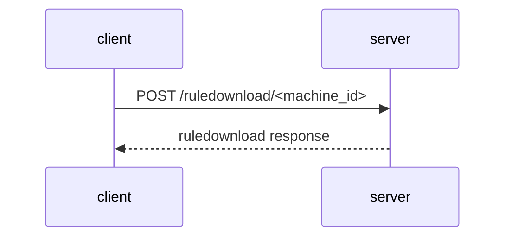

# Syncing Overview

This documents the sync protocol as it exists today. Implementors should be
able to use this to create their own sync servers.

## Background

Santa can be run and configured with a sync server. This allows an admin to
easily configure and sync rules across a fleet of macOS systems.  In addition
to distributing rules using a sync server enables an admin to override some
local configuration options e.g. lockdown mode on both a fleet white and per
host basis. 

The sync protocol sync is used to do the following things:

 - Allows the client (usually santasyncservice) to report config and host information to the server
 - Allows a means for clients to retrieve new configuration options from a server overriding local defaults
 - Supports uploading events for binaries so that the server can log, modify rules in response
 - Allows downloading new rules and add them to the database

# The Santa Sync Server Protocol Overview

The Santa Sync Server Protocol is an HTTP/JSON Restful protocol. As such it is
assumed that both the server and client add `Content-Type` headers set to
`application/json`. 

The Sync Protocol is client initiated and consists of 4 request-response
transactions called stages, `preflight`, 'eventUpload`, `rulesDownload` and `postFlight`. A sync
may consist of all 4 stages, or just the `rulesDownload`. 

| Stage | What it Does |
| **Preflight ** | Report config settings to Sync Server & retrieve new ones |
| **Event Upload** | Report new blockable events to the Sync Server for further analysis |
| **Rule Download** | Retrieves new rules |
| **Postflight** | Reports stats | 

If the server returns a value other than 200 than the sync stops and the next
stage is not performed.

At a high level this looks like the following sequence:


Where `<machine_id>` is a unique string identifier for the client by default
Santa makes this is the string `IOPlatformUUID` from IOKit's
`IOPlatformExpertDevice` aka the hardware UUID.

A sync is used to do the following things:

 - Report config options and machine ID for a Santad instance
 - Provides the means to retrieve new configuration options from a Sync Server
 - Supports uploading events binaries that caused blockable events for further analysis
 - Download new rules and add them to the database

### Stages

All URLs are of the form `/<stage_name>/<machine_id>`, e.g. the preflight URL is `/preflight/<machine_id>`.

#### Preflight

The preflight stage is used by the Client to report host information to the
sync server and to retrieve a limite set of configuration settings from the
Server.

This follows the following transaction:


The request consists of the following JSON keys:

| Key | Required | Type | Meaning | Example Value | 
|---|---|---|---|---|
| serial_num    | YES | string | The macOS serial number from IOKit `kIOPlatformSerialNumberKey` |  "5c8644810000000000000000004330325a333055524c564451000000000000000000000000000000000000" |
| hostname      | YES | string | The fqdn hostname of the client | markowsky.example.com | 
| os_version    | YES | string | The OS version of the client from /System/Library/CoreServices/SystemVersion.plist |  |
| os_build      | YES | string | The OS build from /System/Library/CoreServices/SystemVersion.plist | "21F5048e" |
| model_identifier | NO | string | | | 
| santa_version | YES | string | |
| primary_user  | YES | string | The username | markowsky |
| fcm_token     | NO | string | firebase cloud messaging token (for push notifications) |  |
| binary_rule_count | NO | int | number of binary allow / deny rules the client has at time of sync| 1000 |
| certificate_rule_count | NO | int | number of certificate allow / deny rules the client has at time of sync | 3400 |
| compiler_rule_count | NO | int | number of compiler rules the client has time of sync |
| transitive_rule_count | NO | int | number of transitive rules the client has at the time of sync |
| teamid_rule_count | NO | int | 24 |
| client_mode | YES | string | the mode the client is operating in, either "LOCKDOWN" or "MONITOR" |


Example Preflight request JSON Payload:

```json
{
	"serial_num":   "5c8644810000000000000000004330325a333055524c564451000000000000000000000000000000000000", 
	"hostname": "markowsky.local",
        "santa_version": "2022.3",
        "os_version": "12.4",
        "os_build": "21F5048e",
        "client_mode": "LOCKDOWN",
        "primary_user": "markowsky"
}
```

### Preflight Response 

If all of the data is well formed, the server responds with a HTTP 200 and provides a JSON response with the 
When a 200 is returned by the server it has a JSON object in the response.

This returns a JSON object of with the following keys:

| Key | Required | Type | Meaning | Example Value |
|---|---|---|---|---|
| enable_bundles | NO | boolean | enabled bundle scanning  | true |
| bundles_enabled | NO | boolean |  deprecated key for enabling bundle scanning  | true |
| enable_transitive_rules | NO | boolean | should we enable transitive whitelisting | true |
| batch_size | YES | integer | The number of events to upload at a time? | 128 | 
| fcm_full_sync_interval | NO | integer | number of seconds between full syncs | 14400 |
| fcm_global_rule_sync_deadline | NO | unsigned integer | how often to download new rules from the sync server in seconds | 600 |
| full_sync_interval | YES | integer | number of seconds between full syncs | 600 | 
| client_mode | YES | string | The operating mode the client should be in | either "MONITOR" or "LOCKDOWN" |
| allowed_path_regex | YES | list of strings | list of regular expressions to allow a binary to execute from a path | ["/Users/markowsk/foo/.*"] | 
| blocked_path_regex | YES | list of strings | list of regular expressions to block a binary from executing by path | ["/tmp/"] |
| block_usb_mount | NO | boolean | block usb mass storage devices | true |
| remount_usb__mode | NO | string |  |
| clean_sync | YES | boolean | whether or not the rules should be dropped and synced entirely from the server | "true" or "false" | | 

#### Example Preflight Response Payload

```json
{"enable_bundles": true,
 "bundles_enabled: false,
 "enable_transitive_rules": false,
}
```

# eventsupload

After the `preflight` stage has completed the client then initiates the
`eventUpload` stage if it has any events to upload. If there aren't any events
this stage is skipped.

It consists of the following transaction.


This transaction may be repeated until all events are uploaded to the sync service.

## `eventupload` Request

| Key | Required | Type | Meaning | Example Value |
|---|---|---|---|---|
| events | YES | list of event objects | list of events to upload | see example payload |


### Event Objects

| Key | Required | Type | Meaning | Example Value |
|---|---|---|---|---|
| file_sha256 | YES | string | sha256 of the executable that was blocked | |
| file_path | YES | string | absolute file path to the executable that was blocked | "/tmp/foo" |
| file_name | YES | string | the command portion of the path of the blocked executable | "foo" |
| executing_user | YES | string | the username that executed the binary | "markowsky" |
| execution_time | YES | int | unix timestamp of when the execution occured | 23344234232 |
| loggedin_users | YES | list of strings | list of usernames logged in according to utmp (check) | ["markowsky"] |
| current_sessions | YES | list of strings | check | |
| decision | YES | string | result of if Santa blocked or allowed and why | "ALLOW_BINARY" |
| file_bundle_id | NO | string |  TODO | TODO |
| file_bundle_path | NO | string | TODO | TODO |
| file_bundle_executable_rel_path | NO | string | TODO | TODO |
| file_bundle_name | NO | string | TODO | TODO |
| file_bundle_version | NO | string | TODO | TODO |
| file_bundle_version_string | NO | string | TODO | TODO |
| file_bundle_hash | NO | string | TODO | TODO |
| file_bundle_hash_millis | YES | int | TODO | TODO |
| pid | YES | int | process id of the executable that was blocked | 1234 |
| ppid | YES | int | process id of the parent of the executable that was blocked | 456 |
| parent_name | YES | the short command name of the parent process of the executable that was blocked | "bar" |
| quarantine_data_url | NO | string |  TODO | TODO |
| quarantine_referer_url | NO | string | URL of the referere | TODO |
| quarantine_timestamp | NO | int | UNIX Timestamp of TODO | TODO |
| quarantine_agent_bundle_id | NO | string | TODO | TODO |
| signing_chain | NO | list of signing chain objects | certs used to code sign the executable | |

#### Signing Chain Objects

| Key | Required | Type | Meaning | Example Value |
|---|---|---|---|---|
| sha256 | YES | string | sha256 of the certificate used to sign | TODO |
| cn | YES | string | common name cn field of the certificate used to sign | TODO |
| org | YES | string | org field of the certificate used to sign | TODO |
| ou | YES | string | ou field of the certificate used to sign | TODO |
| valid_from | YES | int | unix timestamp of when the cert was issued | TODO |
| valid_until | YES | int | unix timestamp of when the cert expires | TODO |


### `eventupload` Request Example Payload 

```json
{"events": [ 
   {"file_sha256": " ",
    "file_path": "/tmp/foo",
    "file_name": "foo",
    "executing_user": "markowsky",
    "execution_time": 324343423,   # Unix timestamp
    "logged_in_users": ["markowsky", "hammond"],
    "current_sessions": [],
    "decision": "ALLOW_BINARY",
    "file_bundle_id": "",
    "file_bundle_path": "",
    "file_bundle_executable_rel_path": "",
    "file_bundle_name": "",
    "file_bundle_version": "",
    "file_bundle_version_string": "",
    "file_bundle_hash": "",
    "file_bundle_hash_millis": 19132,
    "pid": 12345,
    "ppid": 45678,
    "parent_name": "/tmp/bar",
    "quarantine_data_url": "http://localhost:1245",
    "quarantine_referer_url": "", 
    "quarantine_timestamp": 13243,
    "quarantine_agent_bundle_id": "",
    "signing_chain": [
       {"sha256": "",
        "cn": "",
        "org": "",
        "ou": "",
        "valid_from": 1323434,
        "valid_until": 234353434,
    }],
   },
]}
```


## `eventupload` Response

The server does not actually send a response other than an HTTP 200.


## `rulesdownload` Stage

After Events have been uploaded to the Sync server, the Client then initiates the `rulesdownload` request. 

Like the previous stages this is a simple HTTP request response cycle like so:



This may be performed many times.

## `ruledownload` Requests

Rules are retrieved from the sync server by having the client (Santa) issues an
HTTP POST request to the url `/ruledownload/<machine_id>`

| Key | Required | Type | Meaning |
|---|---|---|---|
| cursor | NO | string | the last known rule downloaded (comes from sync server) (CHECKME) |


### Example Payload 

On the first request the payload is empty

```json
{}

```

On subsequent requests to the server the cursor value is set.

```json
{"cursor": "2200"}
```

## `ruledownload` Responses

When a rule request is received the sync server responds with a JSON object
containing a list of rule objects and a cursor so the client can resume
downloading if the rules need to be downloaded in multiple batches. 

| Key | Required | Type | Meaning |
| cursor | NO | string | used to continue a rule download in a future request |
| rules | YES | a list of Rule objects | list of rule objects |


### Rules Objects

| Key | Required | Type | Meaning | Example Value | 
|---|---|---|---|---|
| identifier | YES | string | the idenfier the rule should match on | |
| policy | YES | string | identifies the action to perform in response to the rule matching |  |
| rule_type | YES | string | identifies the type of rule | | 
| custom_msg | NO | string | a custom message to display when the rule matches | "Hello" |


### Example `ruledownload` Response Payload

```json
{"rules": [
   {"identifier": "<sha256>", 
    "policy": "ALLOWLIST", 
    "rule_type": "BINARY", 
    "bundle_hash": ""}],
 "cursor": "ff"
}
```


## `postflight` Stage

The postflight stage updates the clients internal counters and is used to
notify the sync server that the sync is complete.

### Post Flight Request

The request is empty and should not be parsed.

### Post Flight Response

The response is empty and should not be parsed by the client.
